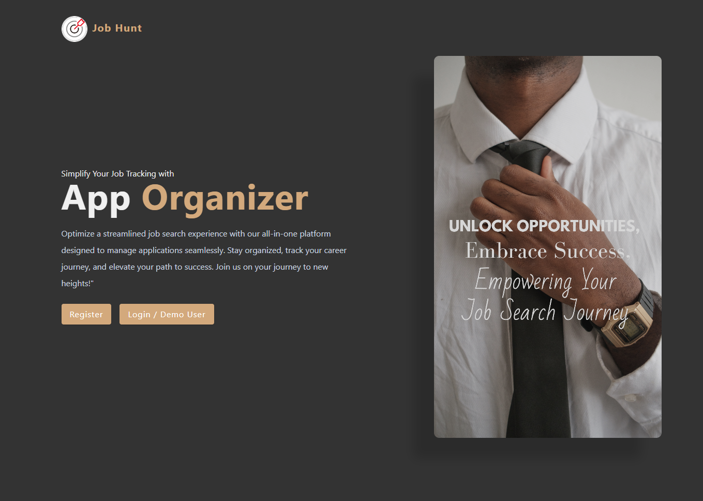
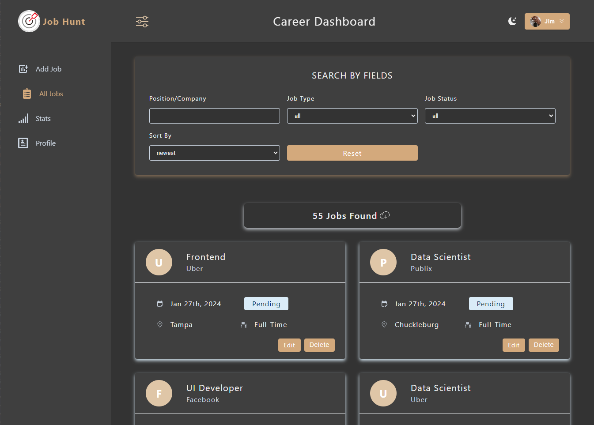
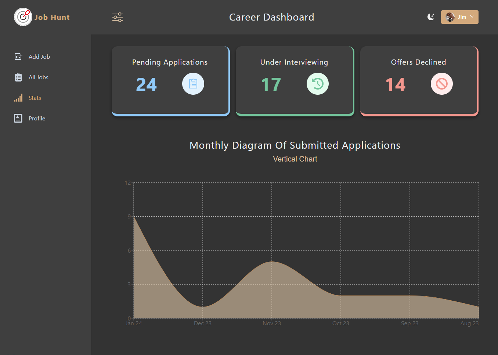
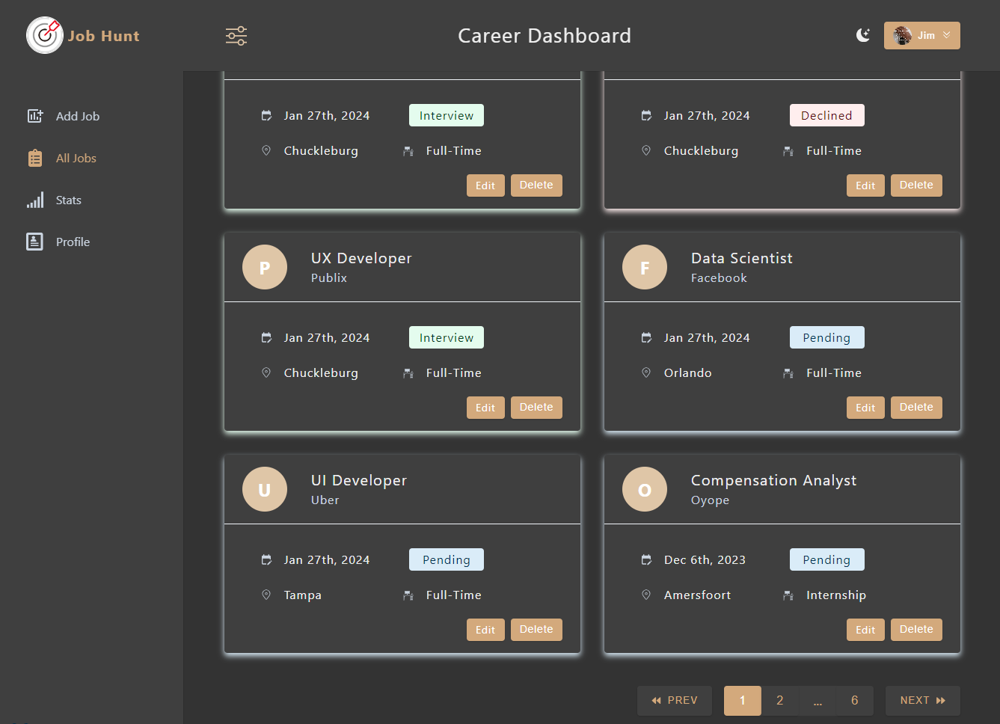

![Commits][commits-shield]
[![Forks][forks-shield]][forks-url]
[![Stargazers][stars-shield]][stars-url]
[![Issues][issues-shield]][issues-url]
[![MIT License][license-shield]][license-url]

<h3 align="center">Job Hunt</h3>

Simplify your job tracking with app organizer. Optimize a streamlined job search experience with our all-in-one platform designed to manage applications seamlessly. Stay organized, track your career journey, and elevate your path to success. Join us on your journey to new heights!"

  

 – LoveLink: Connecting Hearts Through Shared Passions and Personalized Matches

<h3 font size="1" align="right"><a href="https://job-hunt-app.onrender.com" target="_blank">Visit Site🚀</a></h3>

## Table of Contents

<!-- TABLE OF CONTENTS -->

  
Table of Contents

  <ol>
    <li><a href="#tech-stack">Tech Stack</a></li>
    <li><a href="#sneak-peek">Sneak Peek</a></li>
    </ol>

## Tech Stack

(<a href="#readme-top">back to top</a>)

## Sneak Peek

 
  

(<a href="#readme-top">back to top</a>)

<!-- MARKDOWN LINKS & IMAGES -->
<!-- https://www.markdownguide.org/basic-syntax/#reference-style-links -->

[contributors-shield]: https://img.shields.io/github/contributors/ThatZiro/Listy-Flix.svg?style=for-the-badge
[contributors-url]: https://github.com/kurtriecken/love-link/graphs/contributors
[forks-shield]: https://img.shields.io/github/forks/ThatZiro/Listy-Flix.svg?style=for-the-badge
[forks-url]: https://github.com/kurtriecken/love-link/network/members
[stars-shield]: https://img.shields.io/github/stars/ThatZiro/Listy-Flix.svg?style=for-the-badge
[stars-url]: https://github.com/kurtriecken/love-link/stargazers
[issues-shield]: https://img.shields.io/github/issues/ThatZiro/Listy-Flix.svg?style=for-the-badge
[issues-url]: https://github.com/kurtriecken/love-link/issues
[license-shield]: https://img.shields.io/github/license/ThatZiro/Listy-Flix.svg?style=for-the-badge
[license-url]: https://github.com/kurtriecken/love-link/blob/main/LICENSE
[commits-shield]: https://img.shields.io/github/commit-activity/t/kurtriecken/love-link.svg?style=for-the-badge